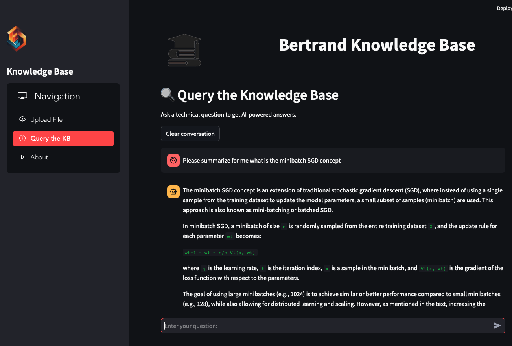
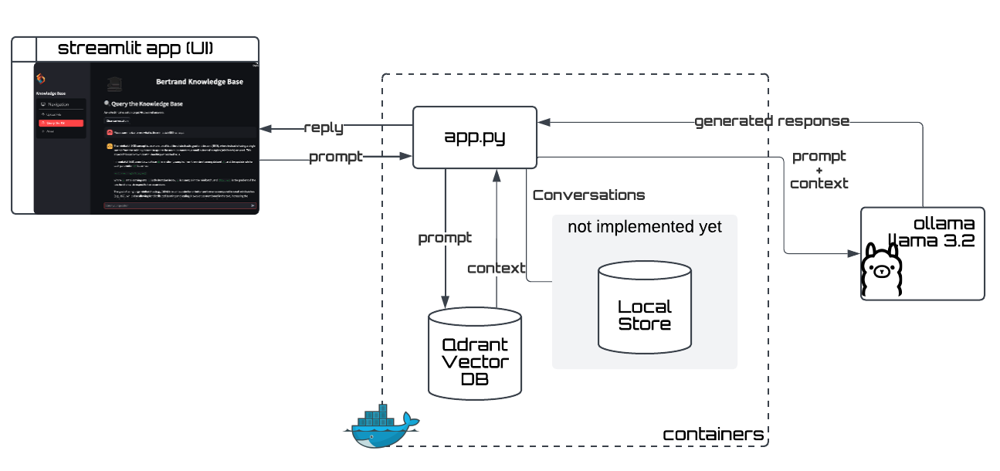

# Bertrand -- Local Knowledge Agent

A basic implementation of a locally-running LLM with RAG.



### Copyright & Licensing

**The code is copyright (c) 2024 AlertAvert.com. All rights reserved**<br>
The code is released under the Apache 2.0 License, see `LICENSE` for details.

[](https://opensource.org/licenses/Apache-2.0)


# System configuration

## System Architecture Overview




1.	*PDF Ingestion and Chunking:*
	Uses `unstructured.io` to extract text and split it into manageable chunks.
2.	*Embedding Generation:*
	Use a suitable embedding model (from `sentence-transformers`).
3.	*Vector Store (Qdrant):*
	Store embeddings and associated metadata in a local Qdrant instance (running via Docker).
4.	*Query Execution:*
	Retrieve relevant chunks from Qdrant based on user input.
5.	*LLM Querying (Ollama):*
	Use Ollama to generate context-aware answers using retrieved chunks.
6.	*Frontend (Streamlit):*
	Provide a user interface for querying the knowledge base and displaying results.


# LLM (Ollama)
We run a local copy of [Meta](https://meta.com)'s [Llama 3.2 3B model](https://ollama.com/library/llama3.2) using `ollama`:

```shell
ollama run llama3.2:latest
```

However, even if the LLM is not running (use `ollama ps` to confirm) it will be started automatically when running the `ollama.generate()` function.

See also [this course on YouTube](https://youtu.be/GWB9ApTPTv4) for more details.


# Vector DB

## Qdrant

[Qdrant](https://qdrant.tech) is a vector database designed for real-time, high-performance similarity search. It offers a simple API and runs efficiently on local machines.
	•	Key Features:
	•	Lightweight and fast.
	•	REST API with gRPC support.
	•	Compatible with embeddings from most AI frameworks.
	•	Installation: Use Docker or pip for Python bindings.

```shell
docker run -p 6333:6333 qdrant/qdrant
```


**Why Qdrant?**
	•	Ease of Use: Simple setup with REST and Python APIs.
	•	Local Storage: Supports persistent storage, so you don’t need to worry about data loss.
	•	Low Complexity: Lightweight, no complex dependencies.
	•	Incremental Updates: Adding new embeddings (from additional PDFs) is straightforward.
	•	Performance: Optimized for local environments and fast similarity searches.

**Recommended Setup:**
	•	Run Qdrant locally via Docker or as a standalone binary.
	•	Use Qdrant’s Python client for embedding storage and querying.

### Implementation

```shell title='Run Qdrant'
docker run -d -p 6333:6333 qdrant/qdrant
```

Created the `bertie` virtualenv (see `requirements.txt`)

# Run Locally

## Python Virtualenv
As with every Python project, the recommended way is to use `virtualenvwrapper`, and create a new venv, then install the dependencies there:

```shell
mkvirtualenv -p $(which python3) bertie
pip install -r requirements.txt
```
this will also install and put on the `PATH` the necessary scripts (`ollama` and `streamlit`).

## Running the KB

The easiest way to run the app is to use `docker-compose`:

```shell
docker compose up -d
```
until integrated with `compose`, the Streamlit app needs to be run manually:<sup>1</sup>

```shell
streamlit run app.py [debug]
```
adding the `debug` flag will generate `DEBUG` logs.

This should open a browser window showing the UI, at `http://localhost:8501`.

<sup>1</sup> See [Issue #2](https://github.com/alertavert/bertrand/issues/2)


# References

- [Unstructured.io Docs](https://unstructured.io/)
- [SentenceTransformers Documentation](https://www.sbert.net/)
- [Qdrant docs](https://qdrant.tech/documentation/)
- [API & SDKs - Qdrant](https://qdrant.tech/documentation/interfaces/)
- [Ollama Model Library](https://github.com/ollama/ollama?tab=readme-ov-file#model-library)

